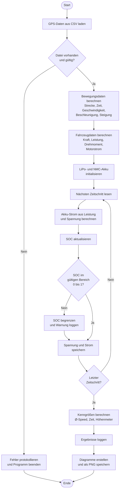

# Aktivitätsdiagramm der E-Bike-Simulation

Das folgende Aktivitätsdiagramm zeigt den vollständigen Ablauf der Simulation
von der Programmstartphase bis zur Ausgabe der Ergebnisse.

## Erläuterung

Der Ablauf beginnt mit dem Einlesen der GPS-Daten aus der CSV-Datei. Falls die
Datei fehlt oder ungültige Werte enthält, wird der Fehler protokolliert und das
Programm beendet.

Aus den GPS-Daten werden zunächst die Bewegungsdaten berechnet (Strecke,
Geschwindigkeit, Beschleunigung, Steigung). Anschließend wird das Fahrzeugmodell
angewendet, um Kraft, Leistung, Drehmoment und Motorstrom zu bestimmen.

Danach werden die beiden Akkus (LiPo und NMC) initialisiert. Für jeden
Zeitschritt der Fahrt wird der benötigte Akku-Strom aus der Leistung und der
aktuellen Akkuspannung berechnet, der Ladezustand aktualisiert und geprüft, ob
er im gültigen Bereich zwischen 0 und 1 liegt. Verlässt der SOC diesen Bereich,
wird er begrenzt und ein Warnhinweis protokolliert.

Nach Abschluss der Simulation werden die Kenngrößen der gesamten Fahrt
berechnet, in der Log-Datei festgehalten und die Ergebnisdiagramme als PNG-Dateien
im Ordner `results/` gespeichert.