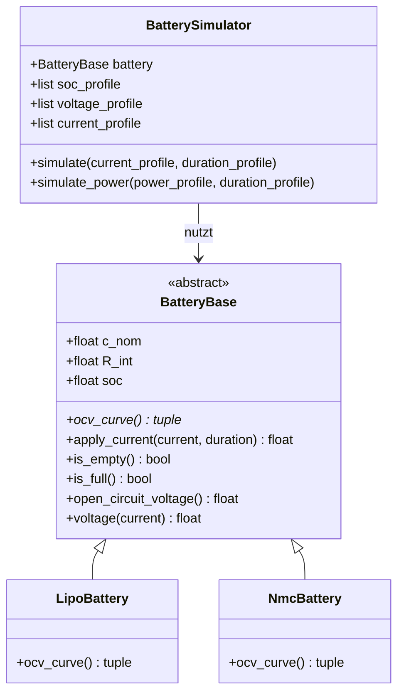

# UML-Klassendiagramm der Akku-Struktur

Das folgende Klassendiagramm zeigt die objektorientierte Struktur der
Akku-Simulation. Die abstrakte Basisklasse `BatteryBase` enthält die gemeinsame
Logik, die beiden konkreten Akkutypen `LipoBattery` und `NmcBattery` liefern über
`ocv_curve()` ihre jeweilige Spannungskennlinie.

## Erläuterung

`BatteryBase` ist als abstrakte Basisklasse (ABC) umgesetzt und kann nicht direkt
instanziert werden. Die Methode `ocv_curve()` ist abstrakt (mit `*` markiert) und
muss von jeder Unterklasse implementiert werden.

`LipoBattery` und `NmcBattery` erben die gesamte Berechnungslogik (Ladezustand,
Spannung unter Last, Grenzwertprüfung) und unterscheiden sich nur durch ihre
Kennlinie und ihren Innenwiderstand.

`BatterySimulator` arbeitet ausschließlich mit dem Typ `BatteryBase` und kann
dadurch beide Akkutypen identisch simulieren (Polymorphismus).